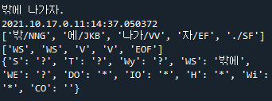

# Update
* [21.10.17](#211017) - 문장 구성 데이터
* [21.10.15](#211015) - 토크나이저 최적화
* [21.10.13](#211013) - 주요소 태그 클래스 구현
* [21.10.12](#211012) - 주요소 태그 형태
* [21.10.10](#211010) - 토크나이저 클래스 구현

## 21.10.17
[Principler](https://github.com/HanGyeolee/korean-conversation/blob/main/principler.py#L11)를 통해서 세분화된 단어들 중 동사만을 가져올 수 있습니다.
가져온 동사를 기반으로 주요소 데이터를 뽑아올 수 있는 데, 반드시 알아야하는 데이터를 '?'로 표시하고 부가적인 데이터를 '&#42;'로 표현하였습니다.
|V|S|T|Wy|WS|WE|DO|IO|H|Wi|CO|
|:-:|:-:|:-:|:-:|:-:|:-:|:-:|:-:|:-:|:-:|:-:|
|가다|?|?|?|&#42;|?|&#42;|&#42;|&#42;|&#42;|&#42;|
|가려워하다|?|?|?|&#42;|&#42;|&#42;|&#42;|&#42;|&#42;|&#42;|

각각 해당하는 단어에 필요한 추가적인 내용 (~에/에게, ~을, ~으로) 등은 [국립국어원 표준국어대사전](https://stdict.korean.go.kr/main/main.do)에 작성된 문형 정보를 토대로 데이터를 작성하였습니다. 뜻이 여러개를 가지는 동사 (예: 가리다.) 의 경우, 가리다0, 가리다1 과 같이 구분을 하였으나 해당 단어를 어떻게 자동으로 선택할지는 아직 고민해봐야할 문제입니다.

다음은 현재까지의 작동 예시입니다.     
4번째 출력에서 'WS' 가 'WE' 로 출력이 되어야 정상작동하는 것입니다.     
아직 주요소 태거의 정확도가 높지 않은 탓입니다.    


## 21.10.15
+ 토크나이저를 전반적으로 수정하였습니다.    
    모든 숫자가 ${number}/SN 하나로 토크나이징 되는 것 처럼 :    
    * 모든 동사 => '${verb}/VV'    
    * 모든 형용사 => '${adjective}/VA'      
    * 모든 종결기호 => '${mark}/SF'      
    * 모든 종결어미 => '${end}/EF'

    주요소를 판별하는 데, 동사의 세부적인 정보는 필요가 없기 때문에 간략하게 표현하였습니다.
    대신 '어제', '오늘'과 같은 시간을 나타내는 명사들은 그대로 'NNG' 태그가 붙으며, 주요소에 제일 중요한 관계언 또한 그대로 각각의 태그가 붙습니다.
    또한, 한자로 시작하는 모든 단어를 토크나이저에서 제외시켰습니다. 이를 통해 816293개에 해당하는 토큰들을 634404개로 단축시킬 수 있었습니다.

+ 주요소에 사용되는 태그에 '보어'를 추가했습니다.    
    주격보어와 목적격보어를 나타낼 태그가 없었기 때문에 추가했습니다.
    |V|S|T|Wy|
    |:---:|:---:|:---:|:---:|
    |서술어|주어|시간|이유|

    |WS|WE|DO|IO|H|Wi|CO|EOF|
    |:---:|:---:|:---:|:---:|:---:|:---:|:---:|:---:|
    |어디에서|어디로|직접목적어|간접목적어|어떻게|누구와|보어|./?/!|

+ [21.10.13](#211013)의 예시 수정

## 21.10.13
[ELEMENTagger](https://github.com/HanGyeolee/korean-conversation/blob/main/mecab/ko/elemen.py)는 문장의 주요소를 추가로 태깅해줍니다.    
``` python
from mecab.ko.tokenizer import Tokenizer
from mecab.ko.elemen import ELEMENTagger

tokenizer = Tokenizer(dicpath=r'vocab.txt') 
tokenizer.tokenizing(string, allattrs=False) #토큰 생성

elementagger = ELEMENTagger(ptpath="~~.pt", vocab_size=tokenizer.getMax() + 1)
elementagger.getElement(tokenizer.tokens) #주요소 추출
```

[공식 튜토리얼 사이트](https://pytorch.org/tutorials/beginner/nlp/sequence_models_tutorial.html)를 참고하여 학습기를 완성시켰습니다.    
아직 데이터셋이 부족하여, Loss 가 2 이상 발생하는 중입니다. (말뭉치를 요청하여 데이터 구축을 준비하는 중입니다.)    

|항목|데이터셋 예시|
|:---:|:---|
|text| 	&#91;'어제/MAG', '부모/NNG', '님/XSN', '께/JKB', '편지/NNG', '를/JKO', '쓰/VV', '었/EP', '어/EF', './SF'&#93; |
|element|	&#91;'T', 'IO', 'IO', 'IO', 'DO', 'DO', 'V', 'V', 'V', 'EOF'&#93;|
|start|	&#91;1, 2, 2, 2, 5, 5, 7, 7, 7, 10&#93;|
|end|	&#91;1, 4, 4, 4, 6, 6, 9, 9, 9, 10&#93;|
|length|10|

## 21.10.12
POSTagger 뿐아니라 문장의 주요소를 태깅하여 쉽게 정보를 뽑아오도록 하려고 ELEMENTagger를 만드는 중입니다.    
LSTM을 이용하여 양방향 태깅을 위한 시퀀스 레이블링을 따라 구현해보았습니다.    
참고한 사이트는 [02. 양방향 RNN을 이용한 품사 태깅](https://wikidocs.net/66747)과 [사용자 정의 DATASET, DATALOADER, TRANSFORMS 작성하기](https://tutorials.pytorch.kr/beginner/data_loading_tutorial.html)입니다.    

주요소에 사용되는 태그들은 다음과 같습니다.
* 중요도 높음

|V|S|T|Wy|
|:---:|:---:|:---:|:---:|
|서술어|주어|시간|이유|
    
* 중요도 낮음  
 
|WS|WE|DO|IO|H|Wi|EOF|
|:---:|:---:|:---:|:---:|:---:|:---:|:---:|
|어디에서|어디로|직접목적어|간접목적어|어떻게|누구와|./?/!|

문장 속 형태소 최대 개수는 512개로 제한하였습니다.    
데이터 셋을 만들다가 부족하다싶으면 더 늘려볼 생각입니다.

## 21.10.10
형태소를 뽑아내는 데에 [KoNLPy](https://konlpy.org/ko/latest/) Mecab 클래스를 사용하였습니다.    
mecab 클래스를 약간 수정하여 "+" 된 어절을 전부 분리하도록 하였습니다.    
[mecab/mecab_tokenizer.py](https://github.com/HanGyeolee/korean-conversation/blob/main/mecab/ko/tokenizer.py)를 통해 분리된 형태소들을 토크나이징할 수 있습니다.    
숫자는 ${number}/SN 로 토크나이징 될 것입니다.

mecab-ko-dic의 모든 어절을 vocab.txt에 저장해두었습니다.    
vocab.txt에 들어간 전체 어휘의 개수는 816293개 입니다.

<b>Ex)</b>    
> 경기 성남시 판교신도시에서 이달 분양하는 중대형 아파트의 3.3m²당 분양가가 2006년보다 200만 원 정도 싼 1500만 원 후반대로 결정될 것으로 보인다.

``` json
[
  218296, 724373, 317499, 396668, 812437, 254248, 191715, 350259, 249027, 291460, 
  816276, 4587, 372880, 816256, 10582, 191764, 816287, 816288, 816287, -1, 
  -1, 816164, 291460, 816137, 191481, 816287, 207053, 191664, 816287, 418926, 
  207370, 365195, 767213, 816284, 816287, 418926, 207370, 413800, 191548, 217693, 
  816266, 816285, 206811, 191746, 771756, 816286, 765791
]
```
-1은 vocab.txt에 포함되지 않은 단어들입니다. 위의 예시에서는 m와 ²가 각각 -1 값을 반환하는 데, 해당 데이터를 무작정 넣어봐야하는 지 고민입니다.    
[test.py의 result](https://github.com/HanGyeolee/korean-conversation/blob/main/test.py#L38) 값에 따라 반환되는 형태를 변경할 수 있으니 여러가지로 활용해볼 수 있겠습니다.
